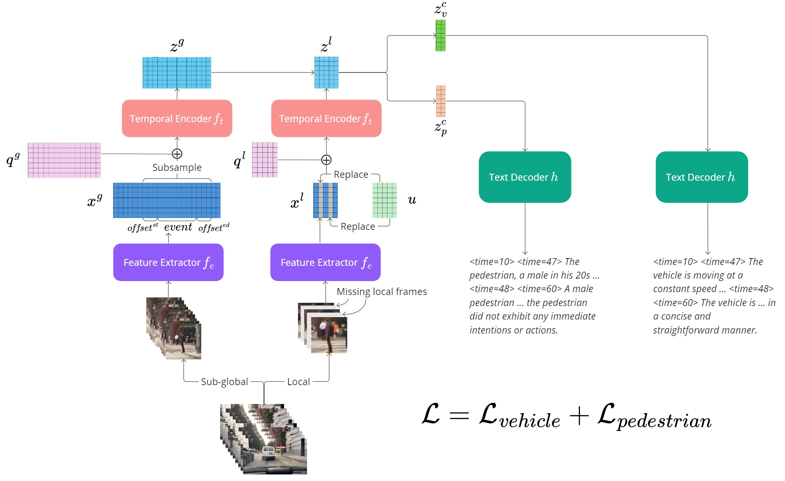

# TrafficVLM: A Controllable Visual Language Model for Traffic Video Captioning



[Quang Minh Dinh](https://github.com/quangminhdinh), [Minh Khoi Ho](https://github.com/hmkhoi2701), [Anh Quan Dang](https://github.com/quandang246), [Hung Phong Tran](https://github.com/hungphongtrn)

This repository contains the official code for the 3th place solution of the [8th AI City Challenge](https://www.aicitychallenge.org/) Track 2.

<!-- #### \[[Paper](https://arxiv.org/abs/2404.09275)\] -->
#### [Paper](https://arxiv.org/abs/2404.09275) | [Slide](https://drive.google.com/file/d/1rQ6jfmmhsOCc5e5RPXTVc3cW2JSVEhYB/view?usp=sharing) | [Poster](https://drive.google.com/file/d/1Tk3keK4GY6iMjK9F38CG2w37hkQRwizC/view?usp=sharing) | Primary contact: [Quang Minh Dinh](https://github.com/quangminhdinh) 

## Requirements

The codebase is tested on

* Ubuntu 20.04
* Python 3.10
* [PyTorch](https://pytorch.org/) 2.1.0
* 1 NVIDIA GPU (RTX 3060) with CUDA version 12.1. (Other GPUs are also suitable, and 12GB GPU memory is sufficient to run our code.)

To install requirements:

```shell
pip install -r requirements.txt
```

## Setup

All main configurations are stored in `config.py`. To complete the necessary setups for training:

* Change `_C.GLOB.EXP_PARENT_DIR` to the path to your log directory. All the experimental logs, metrics, samples, and checkpoints will be stored here.
* Download the `vid2seq_htmchaptersvitt.pth` checkpoint from [VidChapters](https://github.com/antoyang/VidChapters?tab=readme-ov-file#model-checkpoints) (HowTo100M + VidChapters-7M + ViTT). Replace the value of `_C.MODEL.VID2SEQ_PATH` to the path to the downloaded checkpoint. You can try other Vid2Seq checkpoints. If you want to directly start from the T5 checkpoint, set `_C.MODEL.LOAD_VID2SEQ_CKPT` to `False`.
* All the dataset-related paths are stored in `dataset/config.py`. Follow the instructions in [the next section](#data) to prepare the data for training.
* Set `_C.SOLVER.LOG_TO_WANDB` to `False` if you don't want to log to [Wandb](https://wandb.ai/).

Each experiment has a configuration `.yml` file located in `experiments/`. You can create your own experiment by adding a `{EXP_NAME}.yml` file and overwrite the default hyperparameters in `config.py` in the same manner as `experiments/default.yml`.

### Data

Follow the steps outlined in [feature_extraction/README.md](https://github.com/quangminhdinh/TrafficVLM/blob/main/feature_extraction/README.md) to extract the CLIP features for training or download the extracted features [here](https://drive.google.com/file/d/1WInBUBNtclhC8YP5zaIiFoBlt6fnX3mT/view?usp=sharing).

Change all the `sub_global`, `local_annotated`, and `global` paths for each dataset configuration in `dataset/config.py` to the generated feature paths. Change all `captions` paths to the annotation paths.

### Checkpoints

You can download the experiment fine-tuned checkpoints via:

| Experiment Name | For Ablation |                          Download                           |               Descriptions                 | 
| :-------- | :-----------: | :----------------------------------------------------------: | :--------------------------------------| 
| high_fps_wd | Yes | [Google drive link](https://drive.google.com/drive/folders/1KKxZfn0kDmBGMGg5AewjoJUdq6Kx_Fxh?usp=drive_link) | Sub-global |
| local_wd | Yes | [Google drive link](https://drive.google.com/drive/folders/1s38hm-1_gwbCWhvw050ujf3GAZ_urrDF?usp=drive_link) | Sub-global + Local |
| local_temp_wd | Yes | [Google drive link](https://drive.google.com/drive/folders/1RmKg3HNgwvdIQT0xARoaqa4Y5_HIQ5aZ?usp=drive_link) | Sub-global + Local + Phase Encoder |
| global_main_wd | Yes | [Google drive link](https://drive.google.com/drive/folders/1e6fm9qhtsK5HKonneKsxX8GBwlVUTtbg?usp=drive_link) | Global |
| global_main_local_wd | Yes | [Google drive link](https://drive.google.com/drive/folders/1bbo5WmSpHdUXuJBfB1AOWIlGs0rvf0sz?usp=drive_link) | Global + Local + Phase Encoder |
| global_main_sub | Yes | [Google drive link](https://drive.google.com/drive/folders/1jfirYcDvf8dgtEjo-yF_hvirjJxQy75Z?usp=drive_link) | Global + Sub-global |
| global_all_wd | Yes | [Google drive link](https://drive.google.com/drive/folders/12HiRFBtoC7YYSbImUUF3kpV-uv9uW3l_?usp=drive_link) | Global + Sub-global + Local + Phase Encoder |
| high_fps_all | No | [Google drive link](https://drive.google.com/drive/folders/1PJjl4rTvGP-PqBESYiPk4SfPZJWuA9W0?usp=drive_link) | Sub-global |
| local_temp_all | No | [Google drive link](https://drive.google.com/drive/folders/1pCuQxsSUx9vNizdsJ2HNKVrh0I9pj073?usp=drive_link) | Sub-global + Local + Phase Encoder |

And put the files in the log directory as follows

```
{LOG_DIR}
│
├─── high_fps_wd
|       └─ epoch_20.th
├─── local_temp_all
|       ├─ epoch_20.th
|       └─ epoch_30.th
└─── ...
```

To use a checkpoint for an experiment, either set `SOLVER.LOAD_FROM_EPOCH` to the checkpoint epoch number or set `SOLVER.LOAD_FROM_PATH` to the checkpoint path in the experiment `.yml` file.

## Training

To run an experiment:

```shell
python train.py {EXP_NAME}
```

where the experiment `EXP_NAME` has the corresponding configuration file at `experiments/{EXP_NAME}.yml`. 

Training hyper-parameters like device, batch size, validation interval and save interval can be modified in the configuration file.

To replicate the results in Table 2 and Table 3 of the paper, use the corresponding experiment in the checkpoint table at [the previous section](#checkpoints) for the fine-tuning. All the checkpoints selected for evaluation are provided in the checkpoint table.

## Generate Test Samples

Set `SOLVER.LOAD_FROM_EPOCH` to the checkpoint epoch number or `SOLVER.LOAD_FROM_PATH` to the checkpoint path in the experiment `.yml` file.

To generate captions for the samples from the [WTS blind test set](https://github.com/woven-visionai/wts-dataset):

```shell
python generate_test.py {EXP_NAME} -d {DEVICE} -b {BATCH}
```

where:

* `EXP_NAME`: The name of the finished experiment used to generate the test samples.
* `DEVICE`: Decide on which device to run the generation on. Default is `cuda`.
* `BATCH`: The batch size used to batch generate the samples. Default is `1`.

After running the script, the result json can be found in `{LOG_DIR}/{EXP_NAME}/test_results/`.

### AI City Challenge 2024 Results

To replicate the results on Track 2 of the AI City Challenge 2024, first download all `high_fps_all` (epoch 25) and `local_temp_all` (epoch 20, 30) checkpoints from [the checkpoint section](#checkpoints).

For the [internal WTS blind test set](https://github.com/woven-visionai/wts-dataset):

```shell
python generate_test.py high_fps_all
```

For the [external WTS blind test set](https://github.com/woven-visionai/wts-dataset) (you might need higher GPU memory to run the ensembling):

```shell
python ensemble.py ensemble
```

Merge the two result jsons in `{LOG_DIR}/high_fps_all/test_results/` and `{LOG_DIR}/ensemble/` to get the final result json.

## Citation

If you found this work useful, consider giving this repository a star and citing our paper as followed:

```bibtex
@article{dinh2024trafficvlm,
      title={TrafficVLM: A Controllable Visual Language Model for Traffic Video Captioning},
      author={Quang Minh Dinh and Minh Khoi Ho and Anh Quan Dang and Hung Phong Tran},
      journal={arXiv preprint arXiv:2404.09275},
      year={2024}
}
```
