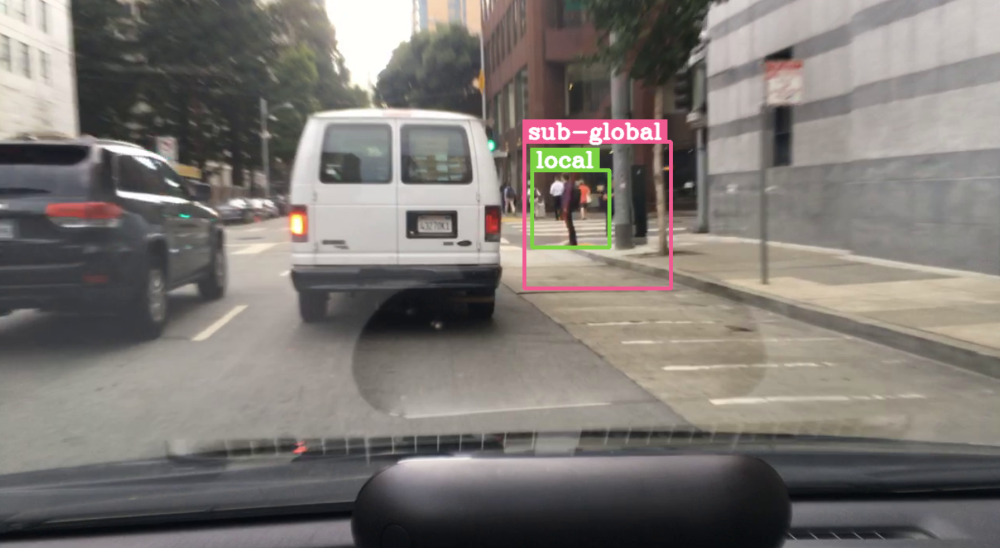

# Feature extractor for WTS dataset

## Steps

> Step 1: Modify the [configuration](config.yaml) file

Destination folders (output paths) are as follows:

```Markdown
    |-- global
    |   |-- external
    |   |   `-- BDD_PC_5K
    |   |       |-- new_bbox/test
    |   |       |-- train
    |   |       `-- val
    |   |-- wts_dataset_test
    |   |   `-- new_bbox/test
    |   |                `-- normal_trimmed
    |   `-- wts_dataset_zip
    |       |-- train
    |       |   `-- normal_trimmed
    |       `-- val
    |           `-- normal_trimmed
    |-- local
    `-- semi_global
```

The content of 'local' and 'semi_global' are the same as 'global'

Here's an example of [config.yaml](config.yaml)

```yaml
paths:
  input_path:  "/home/data/wts_dataset_zip/videos/train" 
  anno_path:   "/home/data/wts_dataset_zip/annotations_new/bbox_annotated/pedestrian/train" 
  output_path: "/home/features/global/wts_dataset_zip/train" 
  CLIP_PATH:   "/home/CLIP" 

feature_type:  "local" 
```

> Step 2: Run [wts_extractor.py](wts_extractor.py)

## General pipeline

> Get bounding boxes from annotation file & video dimension
> Loop through each frame of the video to crop out the frame
> Resize the cropped frame to 224x224 in RGB colorspace
> Feed that frame through CLIP-ViT-L/14 and append to the array that represents the encoded features of the whole video

## Example of levels of view

